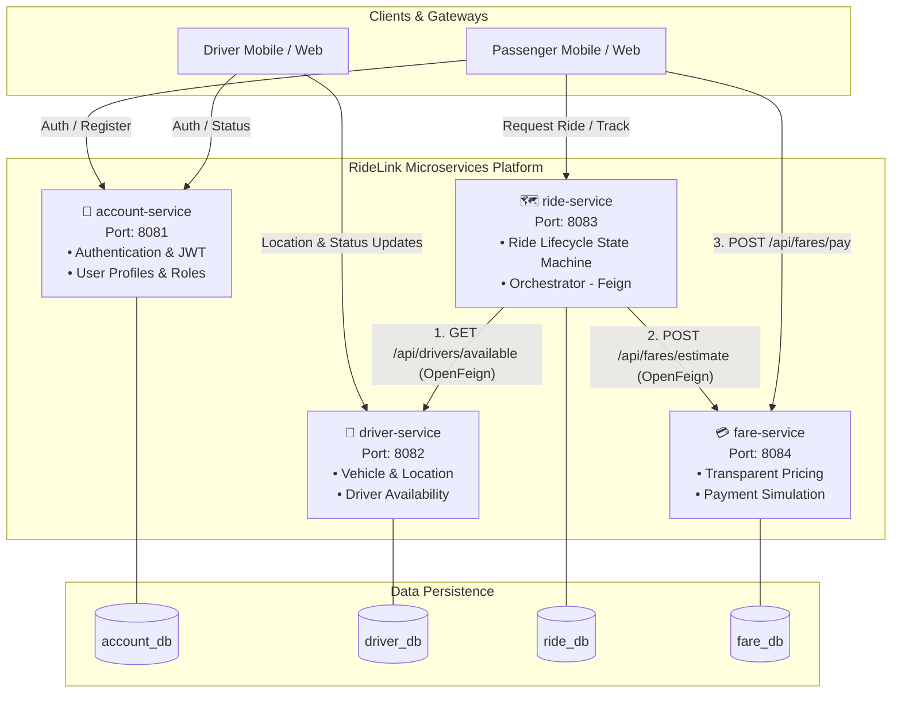

# RideLink Backend - Distributed Microservices Platform

[](https://www.oracle.com/java/)
[](https://spring.io/projects/spring-boot)
[](https://spring.io/projects/spring-cloud-openfeign)
[](https://www.mongodb.com/)
[](https://swagger.io/)
[](LICENSE)

**RideLink** is an enterprise-grade, distributed ride-hailing backend built with a modular microservices architecture. It demonstrates modern cloud-native patterns including declarative inter-service communication (OpenFeign), strict state machine lifecycle enforcement, transparent algorithmic fare calculations, geolocation-based driver dispatching, simulated financial transactions, and automated security and resilience fallbacks.

---

## 🏛️ System Architecture




---

## 📦 Microservices Matrix

| Microservice | Port | MongoDB Database | Primary Responsibilities |
| :--- | :---: | :---: | :--- |
| [`account-service`](file:///d:/Project%20in%20real/RideLink-Backend/account-service) | `8081` | `account_db` | User registration, authentication, JWT tokens, role-based access (`PASSENGER`, `DRIVER`, `ADMIN`), user profiles. |
| [`driver-service`](file:///d:/Project%20in%20real/RideLink-Backend/driver-service) | `8082` | `driver_db` | Driver profile management, vehicle specs (`CAR`, `VAN`, `BIKE`, `TUK`), status lifecycle (`AVAILABLE`, `ON_TRIP`, `OFFLINE`), geolocation updates, area-based dispatch. |
| [`ride-service`](file:///d:/Project%20in%20real/RideLink-Backend/ride-service) | `8083` | `ride_db` | Core ride lifecycle orchestrator. Queries `driver-service` and `fare-service` synchronously via OpenFeign, enforces valid state transitions. |
| [`fare-service`](file:///d:/Project%20in%20real/RideLink-Backend/fare-service) | `8084` | `fare_db` | Algorithmic fare calculation, transparent pricing rules, simulated payment processing (`CASH`, `CARD`, `WALLET`), receipt generation, and failure simulation. |

---

## 🛠️ Technology Stack

- **Runtime & Language**: Java 17 (Eclipse Adoptium OpenJDK)
- **Framework**: Spring Boot 3.x / 4.x
- **Inter-Service Communication**: Spring Cloud OpenFeign (Declarative REST clients)
- **Database**: MongoDB (Spring Data MongoDB)
- **Resilience & Testing Fallback**: `de.bwaldvogel:mongo-java-server` (Automatic in-memory MongoDB when network is offline)
- **API Documentation**: SpringDoc OpenAPI 3.0 / Swagger UI (v2.6.0)
- **Environment Management**: `io.github.cdimascio:dotenv-java` (Zero-hardcoded secrets)
- **Validation**: Jakarta / Hibernate Bean Validation
- **Boilerplate Reduction**: Project Lombok
- **Testing**: JUnit 5, Mockito (`@ExtendWith(MockitoExtension.class)`), Spring Boot Starter Test

---

## 🔐 Environment & Secret Configuration

RideLink strictly adheres to 12-factor application security: **secrets and database credentials are never committed to version control**. Each microservice reads configuration from its dedicated `.env` file, with root `.gitignore` protection.

### Configuration Template

Create a `.env` file inside each microservice directory (e.g., `account-service/.env`, `driver-service/.env`, `ride-service/.env`, `fare-service/.env`):

#### 1. `account-service/.env`
```dotenv
MONGODB_URI=mongodb+srv://<user>:<password>@cluster0.mongodb.net/account_db?appName=Cluster0
JWT_SECRET=superSecretJwtKey32CharactersOrMoreLongForSecurity!
JWT_EXPIRATION_MS=86400000
```

#### 2. `driver-service/.env`
```dotenv
MONGODB_URI=mongodb+srv://<user>:<password>@cluster0.mongodb.net/driver_db?appName=Cluster0
MONGO_URI=mongodb+srv://<user>:<password>@cluster0.mongodb.net/driver_db?appName=Cluster0
```

#### 3. `ride-service/.env`
```dotenv
MONGO_URI=mongodb+srv://<user>:<password>@cluster0.mongodb.net/ride_db?appName=Cluster0
MONGODB_URI=mongodb+srv://<user>:<password>@cluster0.mongodb.net/ride_db?appName=Cluster0
DRIVER_SERVICE_URL=http://localhost:8082
FARE_SERVICE_URL=http://localhost:8084
```

#### 4. `fare-service/.env`
```dotenv
MONGODB_URI=mongodb+srv://<user>:<password>@cluster0.mongodb.net/fare_db?appName=Cluster0
MONGO_URI=mongodb+srv://<user>:<password>@cluster0.mongodb.net/fare_db?appName=Cluster0
```

> [!NOTE]
> **Resilient Database Fallback**: Every microservice includes an automatic connection check at startup. If MongoDB Atlas is unavailable (e.g. offline, corporate firewall, or sandbox), the application automatically starts a local embedded in-memory MongoDB instance. Development and tests run smoothly without network dependencies!

---

## 🚀 Service Deep Dives & Endpoints

### 1. Account Service (`8081`)
Manages identities, security tokens, and user records.
- **Swagger UI**: [http://localhost:8081/swagger-ui.html](http://localhost:8081/swagger-ui.html)
- **API Docs**: [http://localhost:8081/v3/api-docs](http://localhost:8081/v3/api-docs)

| Method | Endpoint | Description |
| :--- | :--- | :--- |
| `POST` | `/api/auth/register` | Register new user with role (`PASSENGER`, `DRIVER`, `ADMIN`) |
| `POST` | `/api/auth/login` | Authenticate credentials and receive Bearer JWT token |
| `GET` | `/api/users/profile` | Retrieve profile of the authenticated user |

---

### 2. Driver Service (`8082`)
Maintains driver operational state, vehicle specifications, and GPS locations.
- **Swagger UI**: [http://localhost:8082/swagger-ui.html](http://localhost:8082/swagger-ui.html)
- **API Docs**: [http://localhost:8082/v3/api-docs](http://localhost:8082/v3/api-docs)

| Method | Endpoint | Description |
| :--- | :--- | :--- |
| `POST` | `/api/drivers` | Register driver operational details, vehicle type (`CAR`, `VAN`, `BIKE`, `TUK`), and license plate |
| `GET` | `/api/drivers/{id}` | Fetch driver profile, status, and location by ID |
| `PATCH` | `/api/drivers/{id}/status` | Update driver availability status (`AVAILABLE`, `ON_TRIP`, `OFFLINE`) |
| `PATCH` | `/api/drivers/{id}/location` | Update simulated GPS coordinates and service area (e.g., `"Colombo"`) |
| `GET` | `/api/drivers/available` | Query available drivers (supports `?serviceArea={area}` or returns all `AVAILABLE`) |

---

### 3. Ride Service (`8083`)
Orchestrates ride requests and enforces valid lifecycle transitions.
- **Swagger UI**: [http://localhost:8083/swagger-ui.html](http://localhost:8083/swagger-ui.html)
- **API Docs**: [http://localhost:8083/v3/api-docs](http://localhost:8083/v3/api-docs)

#### Ride Lifecycle State Machine
```
[REQUESTED] ──> [ASSIGNED] ──> [ACCEPTED] ──> [IN_PROGRESS] ──> [COMPLETED]
     │               │              │               │
     └───────────────┴──────────────┴───────────────┴─────────> [CANCELLED]
```

#### Endpoints
| Method | Endpoint | Description |
| :--- | :--- | :--- |
| `POST` | `/api/rides` | Create ride request: fetches estimated fare via `FareServiceClient`, checks available drivers via `DriverServiceClient`, saves as `REQUESTED` |
| `GET` | `/api/rides/{id}` | Retrieve ride details by ID |
| `PATCH` | `/api/rides/{id}/status` | Transition lifecycle state (enforces strict sequence; invalid jumps throw `400/409`) |
| `GET` | `/api/rides/passenger/{passengerId}` | List historical rides for a specific passenger |

---

### 4. Fare Service (`8084`)
Calculates transparent pricing and handles simulated payment settlement.
- **Swagger UI**: [http://localhost:8084/swagger-ui.html](http://localhost:8084/swagger-ui.html)
- **API Docs**: [http://localhost:8084/v3/api-docs](http://localhost:8084/v3/api-docs)

#### Pricing Formula
$$\text{Estimated Fare} = \max\Big(\text{baseRate} + (\text{distanceKm} \times \text{perKmRate}),\; \text{minimumFare}\Big)$$
- `fare.base-rate`: **150.0 LKR**
- `fare.per-km-rate`: **80.0 LKR/km**
- `fare.minimum-fare`: **250.0 LKR**

#### Endpoints
| Method | Endpoint | Description |
| :--- | :--- | :--- |
| `POST` | `/api/fares/estimate` | Computes fare estimation and documents the applied pricing rule |
| `POST` | `/api/fares/pay` | Processes payment (`SIMULATED_CASH`, `SIMULATED_CARD`, `SIMULATED_WALLET`), generates `REC-XXXXXXXXXX` receipt, and supports `simulateFailure=true` |
| `GET` | `/api/fares/receipt/{rideId}` | Fetches detailed payment receipt and fee breakdown by ride ID |

---

## 🧪 Comprehensive Unit & Negative Scenario Testing

All core services have comprehensive unit tests written using JUnit 5 and `@ExtendWith(MockitoExtension.class)`.

### Key Evaluation Scenarios

1. **Ride Creation Success**:
   - Synchronous fare estimation succeeds + drivers available &rarr; Ride saved with `REQUESTED` status.
2. **No Drivers Available (Negative Scenario 1)**:
   - `DriverServiceClient` returns an empty list `[]` &rarr; Throws `NoDriversAvailableException` with message `"No eligible drivers available in this area"` (`HTTP 404`).
3. **Invalid Status Jump (Negative Scenario 2)**:
   - Direct jump from `REQUESTED` directly to `COMPLETED` &rarr; Throws `InvalidStatusTransitionException` with message `"Cannot transition ride from REQUESTED to COMPLETED"` (`HTTP 400`).
4. **Duplicate Driver Registration**:
   - Registering a driver with an existing `userId` &rarr; Throws `IllegalArgumentException` (`HTTP 400`).
5. **Simulated Payment Failure**:
   - Processing payment with `simulateFailure = true` &rarr; Throws `PaymentFailedException` with message `"Simulated payment failed: Card declined or insufficient funds"` (`HTTP 402`), and marks transaction as `FAILED`.
6. **Duplicate Payment Prevention**:
   - Processing payment for an already settled `rideId` &rarr; Throws `DuplicatePaymentException` (`HTTP 409`).

### Running Tests

Execute the test suites from the root directory or inside each service folder:

```powershell
# Ride Service Tests (13 tests)
cd ride-service
.\mvnw.cmd test -Dtest=RideServiceTest

# Driver Service Tests (12 tests)
cd ..\driver-service
.\mvnw.cmd test -Dtest=DriverServiceTest

# Fare Service Tests (8 tests)
cd ..\fare-service
.\mvnw.cmd test -Dtest=FareServiceTest
```

---

## 🏃 Running the Platform Locally

To launch all four microservices in separate terminal sessions:

```powershell
# Terminal 1 - Account Service (Port 8081)
cd account-service
.\mvnw.cmd spring-boot:run

# Terminal 2 - Driver Service (Port 8082)
cd driver-service
.\mvnw.cmd spring-boot:run

# Terminal 3 - Ride Service (Port 8083)
cd ride-service
.\mvnw.cmd spring-boot:run

# Terminal 4 - Fare Service (Port 8084)
cd fare-service
.\mvnw.cmd spring-boot:run
```

---

## 🔄 End-to-End Workflow Demonstration

### 1. Register & Make Driver Available
```bash
# Register driver (driver-service: 8082)
curl -X POST http://localhost:8082/api/drivers \
  -H "Content-Type: application/json" \
  -d '{
    "userId": "user-drv-101",
    "fullName": "Kasun Perera",
    "phoneNumber": "+94771234567",
    "licenseNumber": "B1234567",
    "vehicle": {
      "vehicleNumber": "CAB-1234",
      "model": "Toyota Prius",
      "vehicleType": "CAR",
      "color": "White"
    }
  }'

# Update status to AVAILABLE
curl -X PATCH http://localhost:8082/api/drivers/<DRIVER_ID>/status \
  -H "Content-Type: application/json" \
  -d '{"status": "AVAILABLE"}'
```

### 2. Request a Ride
```bash
# Request ride (ride-service: 8083)
# Automatically queries driver-service for available drivers and fare-service for price estimate
curl -X POST http://localhost:8083/api/rides \
  -H "Content-Type: application/json" \
  -d '{
    "passengerId": "user-pass-202",
    "pickupLocation": {"latitude": 6.9271, "longitude": 79.8612, "address": "Colombo Fort"},
    "destinationLocation": {"latitude": 6.9015, "longitude": 79.8540, "address": "Bambalapitiya"},
    "distanceKm": 5.5
  }'
```

### 3. Transition Ride Lifecycle
```bash
# Assign driver
curl -X PATCH http://localhost:8083/api/rides/<RIDE_ID>/status \
  -H "Content-Type: application/json" \
  -d '{"status": "ASSIGNED", "driverId": "<DRIVER_ID>"}'

# Accept ride
curl -X PATCH http://localhost:8083/api/rides/<RIDE_ID>/status \
  -H "Content-Type: application/json" \
  -d '{"status": "ACCEPTED"}'

# Start trip
curl -X PATCH http://localhost:8083/api/rides/<RIDE_ID>/status \
  -H "Content-Type: application/json" \
  -d '{"status": "IN_PROGRESS"}'

# Complete trip
curl -X PATCH http://localhost:8083/api/rides/<RIDE_ID>/status \
  -H "Content-Type: application/json" \
  -d '{"status": "COMPLETED"}'
```

### 4. Process Payment
```bash
# Settle fare (fare-service: 8084)
curl -X POST http://localhost:8084/api/fares/pay \
  -H "Content-Type: application/json" \
  -d '{
    "rideId": "<RIDE_ID>",
    "passengerId": "user-pass-202",
    "driverId": "<DRIVER_ID>",
    "distanceKm": 5.5,
    "paymentMethod": "SIMULATED_CARD"
  }'

# Fetch receipt
curl -X GET http://localhost:8084/api/fares/receipt/<RIDE_ID>
```

---

## 📄 License
This project is open-source and available under the [MIT License](LICENSE).
